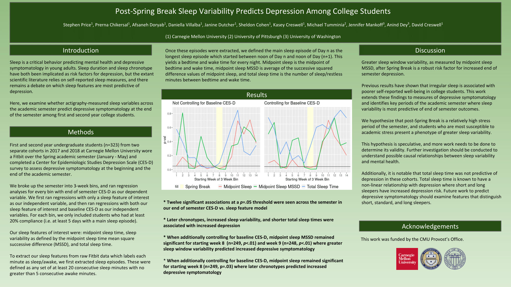

<a href="SLEEP2020_0258_Price.pdf" download>Download PDF</a>

This is a poster presented at Virtual SLEEP 2020 with accompanying analysis code. Underlying data is sensitive, but can be made available under reasonable request. **SLEEP_poster_analysis.ipynb** computes the sleep features and generates the 3-week bins that contain both sleep feature and CESD values. **SLEEP_poster_regression_analyses.R** runs the regression analyses and produces the poster visualizations.

The initial abstract/title were submitted on analyses conducted only on the 2018 cohort. After initial abstract submission, we were able to add the 2017 cohort to the dataset, and these are the results presented on the poster. This is why the citation and the poster have differing titles.

If you use these results, please cite:

**Price, S., Chikersal, P., Doryab, A., Villalba, D., Dutcher, J., Tumminia, M., Cohen, S., Creswell, K., Mankoff, J. Dey, A., Creswell, D. _Early Semester Sleep Variability Predicts Depression Among College Students_. Poster presented at Virtual SLEEP 2020, August 2020.**

